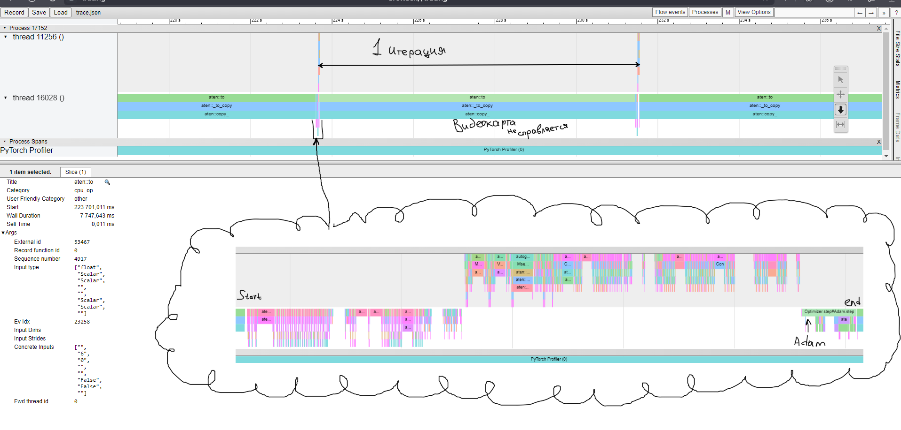

# NeuroNetwork

Эта часть проекта представляет собой обучение нейросети, с помощью `Pytorch`.

## Стек технологий

- **ML Framework**: PyTorch 2.5.1
- **Language**: Python 3.12.1
- **Visualization**: Matplotlib


## Почему модель маленькая?

Результат профилирования при обучении модели.

Как видно больше всего времени при обучении занимается функция ```aten::to```. Она свидетельствует о маленькой видеопамяти.

Площадки Google Colab и Kaggle не позволяют работать в мультифайловых проектах + в них не помещался датасет.

