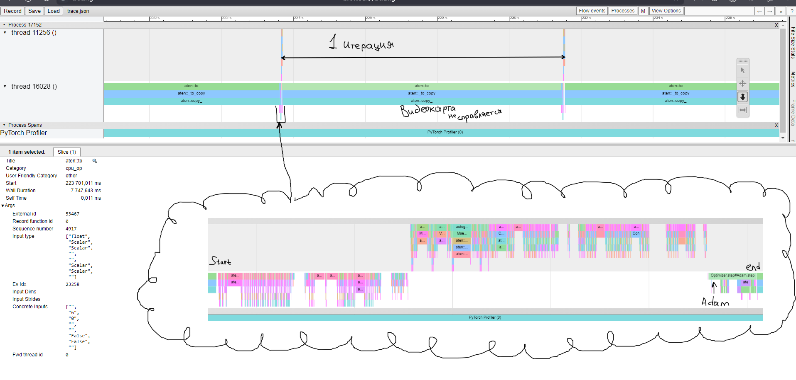

# NeuroNetwork

Эта часть проекта представляет собой обучение нейросети, с помощью `Pytorch`.

## Стек технологий

- **ML Framework**: PyTorch 2.5.1
- **Language**: Python 3.12.1
- **Visualization**: Matplotlib


1. Создать MAR-файл с моделью при помощи torch-model-archiver:
```
torch-model-archiver 
    --model-name densenet161
    --version 1.0
    --model-file model.py
    --serialized-file densenet161-8d451a50.pth
    --extra-files examples/image_classifier/index_to_name.json
    --handler image_classifier
```

— **model-name**: имя, которое будет иметь сгенерированный файл MAR, готовый к использованию.
— **version**: это необязательно, хотя рекомендуется включать версии моделей, чтобы обеспечить их правильное отслеживание.
— **model-file**: файл, в котором определена архитектура модели.
— **serialized-file**: dumped state_dictвесов обученной модели.
— **handler**: файл Python, который определяет предварительную обработку данных, вывод и постобработку.
— **extra-files**: поскольку это проблема классификации, вы можете включить словарь json, содержащий отношения между идентификаторами (цель модели) и метками или также дополнительными файлами, необходимыми файлу модели для более чистого форматирования выходных данных.

2. Настроить docker-compose


## Почему модель маленькая?

Результат профилирования при обучении модели.

Как видно больше всего времени при обучении занимается функция ```aten::to```. Она свидетельствует о маленькой видеопамяти.

Площадки Google Colab и Kaggle не позволяют работать в мультифайловых проектах + в них не помещался датасет.

