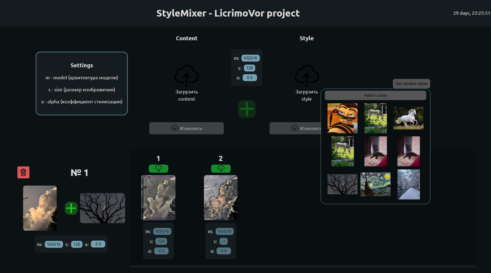

# StyleMixer

Материалы:
    [metmuseum](https://www.metmuseum.org/) - хз че
    [DLS_streamlit_kit_tutor](https://github.com/Kotyga/DLS_streamlit_kit_tutor) - туториал по стримлиту (мб пригодится)
    [abnormal_apartments](https://github.com/Kotyga/abnormal_apartments) - демо проект
    [вебинарчик](https://www.youtube.com/watch?v=1ukXB_sV4-E)
    [deploy](https://yandex.cloud/ru/docs/datasphere/concepts/deploy/) - ноды
    [ТЗ](https://docs.google.com/document/d/1l78PLjZMMSlCc81EX96KqfLQk19y7gQyuKMPKRVEQ-w/edit?tab=t.0#heading=h.bwowaafvsda6) - и не только
    [Датасет_1](https://huggingface.co/datasets/huggan/wikiart?row=0)
    [Датасет_2](https://huggingface.co/datasets/phiyodr/coco2017)
